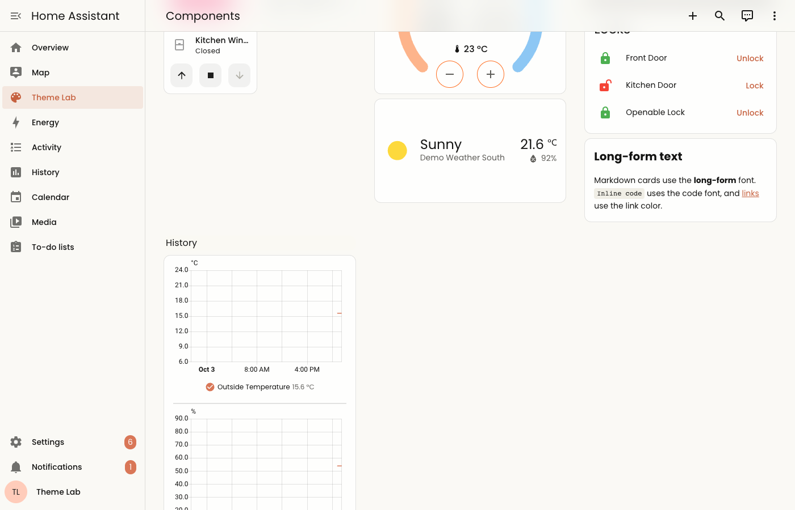
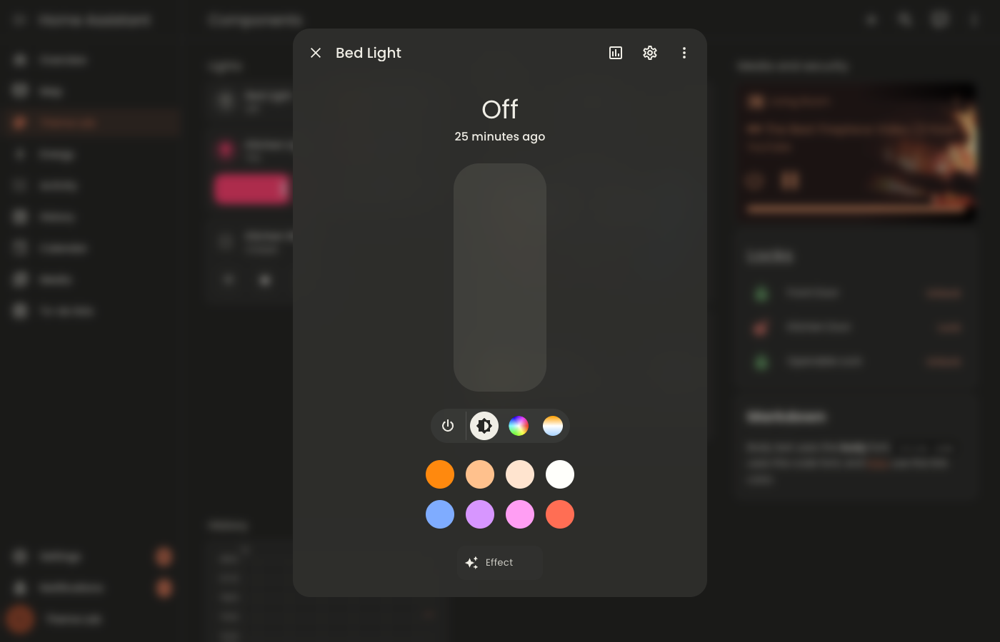
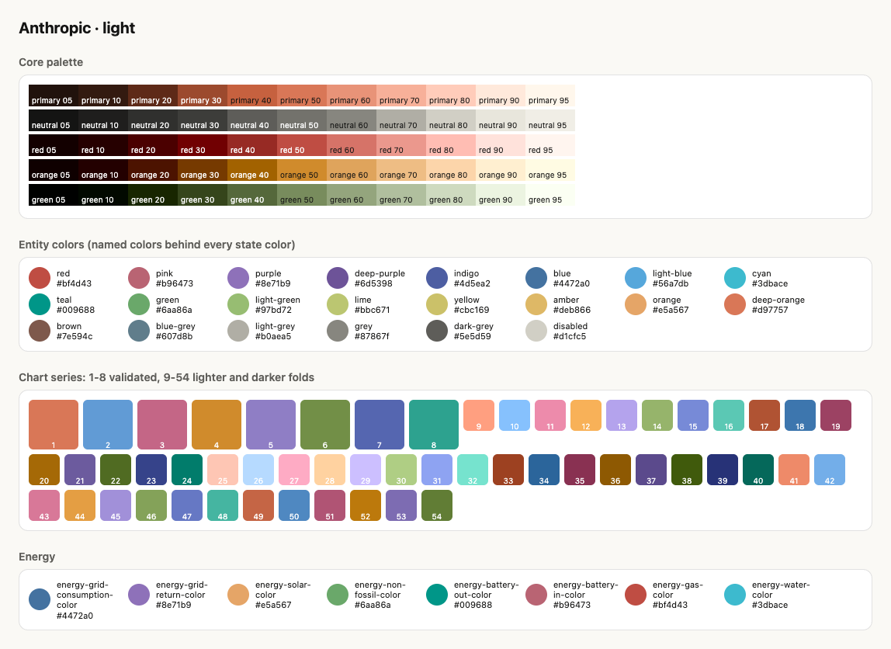
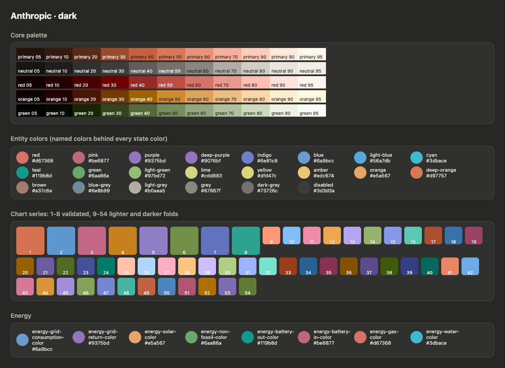

# HA Themes

[](https://github.com/roquerodrigo/ha-themes/actions/workflows/ci.yml)
[](https://github.com/hacs/integration)

[](https://my.home-assistant.io/redirect/hacs_repository/?owner=roquerodrigo&repository=ha-themes&category=integration)

---

Themes for the current Home Assistant frontend, built from its real design tokens.

The frontend's theming surface changed substantially in 2025–2026 (a core palette with
semantic color layers, Web Awesome components, foundation tokens for spacing, radii and
motion), and most theme documentation describes the older variable set. This project
captures the tokens the running frontend actually declares and reads, documents them, builds
themes from a small validated definition, and ships them as an integration that installs
the themes and the support module they need.

| Light | Dark |
| --- | --- |
|  |  |

## Themes

| Theme | Description |
| --- | --- |
| Anthropic | Warm paper neutrals, clay primary, brand blue and green accents; Poppins |
| Anthropic System UI | The same theme in the platform's UI font |

Every theme has light and dark modes and follows the
[house conventions](docs/creating-a-theme.md#house-conventions): sidebar and header in the
page background, no shadows, backdrop blur on the header, cards and dialogs, a harmonized
entity palette, chart series validated for color-vision deficiencies, generic integration
icons in the primary color, and a system-ui variant.

| Palette, light | Palette, dark |
| --- | --- |
|  |  |

## Installation

1. Make sure `configuration.yaml` loads themes from the `themes` directory (most
   installations that use HACS themes already do):

   ```yaml
   frontend:
     themes: !include_dir_merge_named themes
   ```

2. In HACS, add this repository as a custom repository of type **Integration** (or use
   the button above), download **HA Themes** and restart Home Assistant.
3. Go to **Settings → Devices & services → Add integration → HA Themes** and confirm.
4. Pick a theme in your profile.

The integration:

- installs the themes into `themes/ha_themes/` and reloads them — updates arrive with every
  HACS update, and removing the integration removes the files;
- loads a support module on every page, which applies the theme font to the whole UI
  (Home Assistant hard-codes Roboto on the page body), loads web fonts and recolors the
  generic integration icons. It is served under a content-hash URL, so browser and service
  worker caches never keep an outdated copy;
- raises a repair issue if the themes directory is not included in `configuration.yaml`.

## Documentation

| Path | What it is |
| --- | --- |
| [`docs/theming-guide.md`](docs/theming-guide.md) | How themes are applied today: token layers, modes, derived values, entity and chart colors, fonts, icons, known upstream issues |
| [`docs/creating-a-theme.md`](docs/creating-a-theme.md) | Theme definition schema, roles, palettes and validation |
| [`docs/tokens-global.md`](docs/tokens-global.md) | Every globally declared token with light and dark defaults (generated) |
| [`docs/tokens-components.md`](docs/tokens-components.md) | Component hooks and dynamic token families (generated) |
| [`catalog/tokens.json`](catalog/tokens.json) | Machine-readable catalog the builder validates against |

## Development

Requires Python 3.14, [uv](https://docs.astral.sh/uv/) and Google Chrome.

| Path | What it is |
| --- | --- |
| [`custom_components/ha_themes/`](custom_components/ha_themes) | The integration; `themes/` and `frontend/` inside it are generated |
| [`themes-src/`](themes-src) | Theme definitions |
| [`toolkit/`](toolkit) | Token capture, documentation and theme builder (not shipped) |
| [`dev/`](dev) | Local Home Assistant configuration with demo entities and the Theme Lab dashboard |
| [`previews/`](previews) | Palette sheets and screenshots of every theme in both modes |

```bash
scripts/setup                      # install the development environment
scripts/dev-server                 # local Home Assistant on :8123 running the integration
scripts/ha-themes onboard          # first run only: test user + the integration
```

| Command | Purpose |
| --- | --- |
| `scripts/ha-themes build [slug…] [--strict]` | Build `themes-src/` into the integration and validate |
| `scripts/ha-themes preview [slug…] [--palette-only]` | Render palette sheets and screenshot themes in Google Chrome |
| `scripts/ha-themes palette [slug…]` | Rank chart series orders that pass the checks, and list entity colors |
| `scripts/ha-themes catalog` | Re-capture the token catalog from the dev instance and regenerate the reference docs |
| `scripts/ha-themes docs` | Regenerate the reference docs from `catalog/tokens.json` |
| `scripts/lint` | Format check, lint, type check and tests, as CI runs them |

The dev server mirrors `custom_components/ha_themes` into the dev configuration on every
start; after `ha-themes build`, restart it (or reload the integration) to see a change.

### Updating to a new Home Assistant release

1. Bump `homeassistant`, `home-assistant-frontend` and the matching
   `pytest-homeassistant-custom-component` in `pyproject.toml`, and `homeassistant` in
   `hacs.json`; run `uv sync`.
2. Restart `scripts/dev-server` and run `scripts/ha-themes catalog`.
3. Review the diff of `catalog/tokens.json` and the generated docs: new, removed and changed
   tokens, and the broken-reference list.
4. Run `scripts/ha-themes build --strict` — unknown tokens point at themes that need updating.
5. Regenerate previews and compare.

### How the catalog is captured

- **Runtime (Google Chrome):** the installed Chrome is driven through Playwright with an
  isolated profile. In light and dark mode it reads every custom property declared on
  `html` in the document and adopted stylesheets, the inline values the theme engine sets,
  and their computed values.
- **Bundle scan:** every chunk of the installed frontend package is scanned for
  `var(--token, fallback)` references, script reads and dynamically built names, which
  yields how widely each token is used and the component hooks that are never declared
  globally.

## Brand assets

`custom_components/ha_themes/brand/` still holds the blueprint's `TODO` placeholders. Replace
them with the project's icon and logo before the first release.
