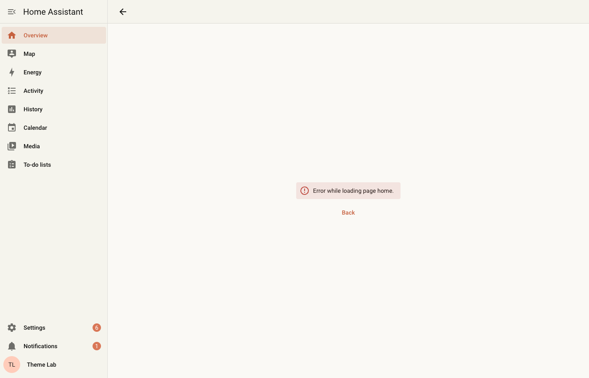
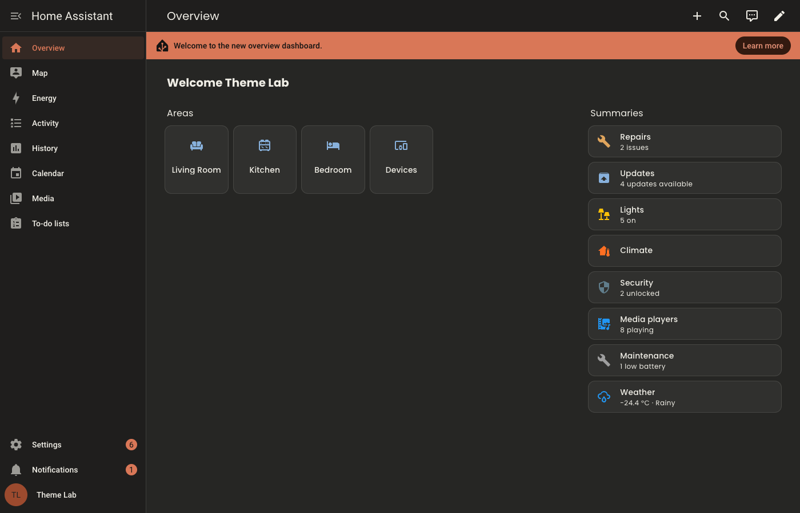

# ha-themes

Design-token catalog and theme builder for the current Home Assistant frontend.

The frontend's theming surface changed substantially in 2025–2026 (a core palette with
semantic color layers, Web Awesome components, foundation tokens for spacing, radii and
motion), and most theme documentation describes the older variable set. This project
captures the tokens the running frontend actually declares and reads, documents them, and
builds themes from a small, validated definition.

| Light | Dark |
| --- | --- |
|  |  |

## Contents

| Path | What it is |
| --- | --- |
| [`docs/theming-guide.md`](docs/theming-guide.md) | How themes are applied today: token layers, modes, derived values, known upstream issues |
| [`docs/creating-a-theme.md`](docs/creating-a-theme.md) | Theme definition schema, roles and validation |
| [`docs/tokens-global.md`](docs/tokens-global.md) | Every globally declared token with light and dark defaults (generated) |
| [`docs/tokens-components.md`](docs/tokens-components.md) | Component hooks read by components but never declared (generated) |
| [`catalog/tokens.json`](catalog/tokens.json) | Machine-readable catalog the builder validates against |
| [`themes-src/`](themes-src) | Theme definitions |
| [`themes/`](themes) | Generated Home Assistant theme files, ready to install |
| [`www/ha-themes/`](www/ha-themes) | Generated font loaders |
| [`previews/`](previews) | Screenshots of every theme in both modes |

## Themes

| Theme | Description |
| --- | --- |
| [Anthropic](themes/anthropic.yaml) | Warm paper neutrals, clay primary, brand blue and green accents; Poppins and Lora |

Installation steps are in [creating-a-theme.md](docs/creating-a-theme.md#installing-a-theme).

## Development

Requires Python 3.14, [uv](https://docs.astral.sh/uv/) and Google Chrome.

```bash
uv sync
scripts/dev-server                 # local Home Assistant with demo entities on :8123
uv run python scripts/dev-onboard.py   # first run only: creates the local test user
```

| Command | Purpose |
| --- | --- |
| `uv run ha-themes build [slug…] [--strict]` | Build `themes-src/` into `themes/` and validate |
| `uv run ha-themes preview [slug…]` | Screenshot themes in Google Chrome into `previews/` |
| `uv run ha-themes catalog` | Re-capture the token catalog from the dev instance and regenerate the reference docs |
| `uv run ha-themes docs` | Regenerate the reference docs from `catalog/tokens.json` |
| `uv run pytest` / `uv run ruff check` | Tests and lint |

The dev instance serves `themes/` directly, so `ha-themes build` followed by the
`frontend.reload_themes` action is enough to see a change.

### Updating to a new Home Assistant release

1. Bump `homeassistant` and `home-assistant-frontend` in `pyproject.toml` and run `uv sync`.
2. Restart `scripts/dev-server` and run `uv run ha-themes catalog`.
3. Review the diff of `catalog/tokens.json` and the generated docs: new, removed and changed
   tokens, and the broken-reference list.
4. Run `uv run ha-themes build --strict` — unknown tokens point at themes that need updating.
5. Regenerate previews and compare.

### How the catalog is captured

- **Runtime (Google Chrome):** the installed Chrome is driven through Playwright with an
  isolated profile. In light and dark mode it reads every custom property declared on
  `html` in the document and adopted stylesheets, the inline values the theme engine sets,
  and their computed values.
- **Bundle scan:** every chunk of the installed frontend package is scanned for
  `var(--token, fallback)` references, which yields how widely each token is used and the
  component hooks that are never declared globally.
